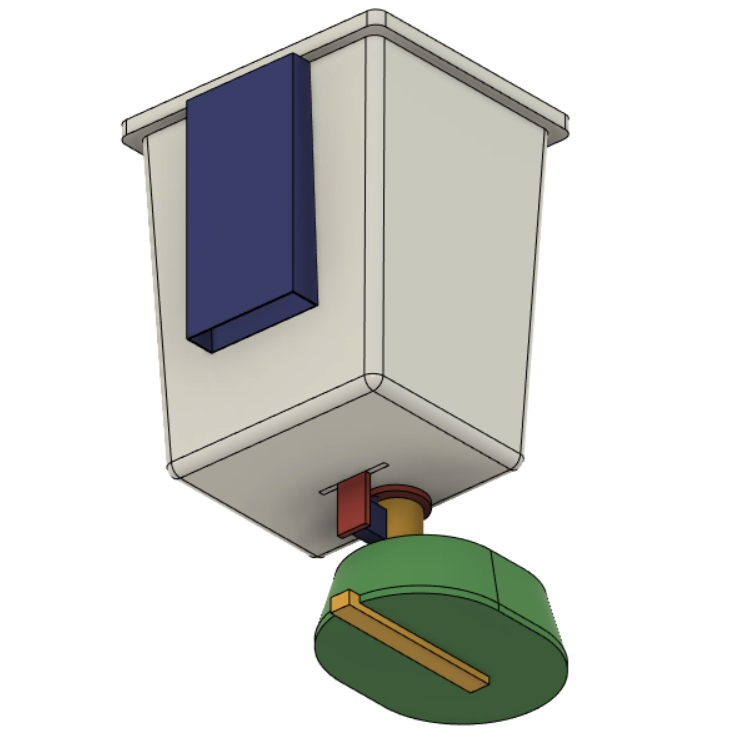

# Vital-Home-System
Home automation system based on OpenHAB and custom items

1. For the hub we use https://www.openhab.org/
   - OpenHabian is installed on Raspberry PI model A (1 version)
   - Web interface can be accessed locally only http://192.168.0.115:8080/
   - Logs http://192.168.0.115:9001/
   - Communication between devices:  

2. First custom project is an automatic pet feeder.
 - Schematic:  

- 3D model:  

- Real model:   

